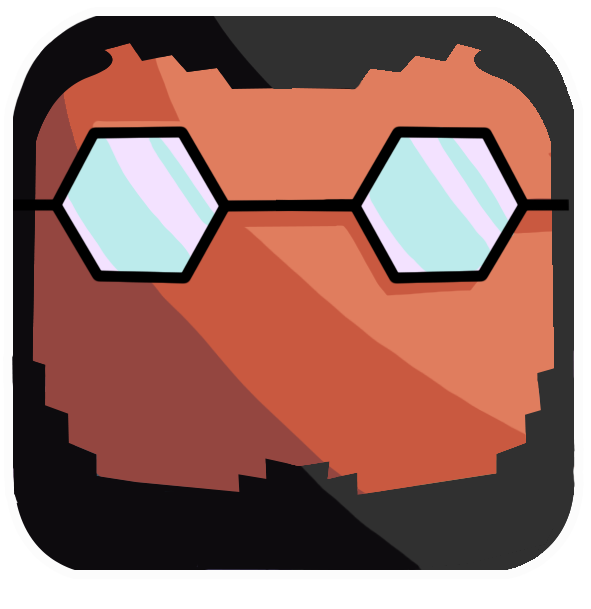

 

  

  <h3 align="center">About Me</h3>

  

"Good code is his best documentation"
- Steve McConnell 
     
    <a href="https://github.com/RicardOP-gdev?tab=repositories"><strong>Explore my repositories »</strong></a>
     
     
    <a href="https://github.com/RicardOP-gdev/BattlePin">Battle Pin</a>
    ·
    <a href="https://github.com/RicardOP-gdev/SnakeAR">Snake AR</a>
  

<!-- PRESENTATION -->
## Presentation

- 👋 Hi, I’m Ricard Orpí!
- 👀 I’m interested to find a job related to the wolrd of Software Development.
- 🌱 I’m currently applying in la Salle (Univeritat Ramon Llull) to do the degree in Multimedia Engineering.

<!-- REEL -->
## DemoReel

DemoReel - [Youtube Link](https://youtu.be/LbHoayk5W70)

<!-- CONTACT -->
## Contact

E-Mail: rop.gdev@gmail.com

IG Profile: [@rop.gdev](https://www.instagram.com/rop.gdev/)
